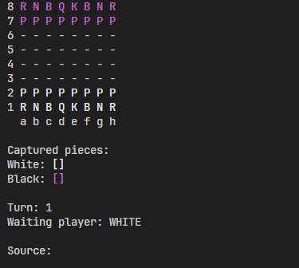
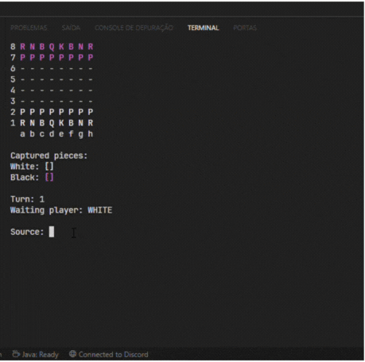
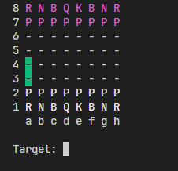
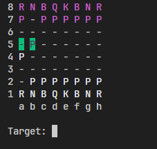
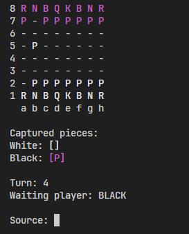

## Chess System ♟️

<p align="center">


</p>


## 🤔 O que é esse projeto?
Esse é um projeto feito totalmente em Java e que consiste em simular uma partida de xadrez pelo terminal do seu sistema operacional.

## 💻 Como rodar esse projeto?
Para rodar o projeto você vai precisar estar com o Java instalado - de preferência a versão JDK. Você pode instalar através do site da [Oracle JDK](https://www.oracle.com/java/technologies/downloads/)

Uma vez que o Java já está instalado, você poderá baixar o projeto pelo GitHub e abrir o terminal do seu sistema operacional e rodar o seguinte comando:

```
java Program
```

Após rodar este comando será possível jogar sua partida de xadrez.


## 🕹️ Como usar este projeto?
Quando o programa estiver rodando, você verá uma imagem como essa:
<p align="center">

</p>

Na opção **Source** é onde será inserido os comandos para movimentar as peças. O tabuleiro de xadrez é uma matriz 8x8 em que o eixo X vai de **A** até **H** e o eixo Y vai de **1** a **8**. Dessa forma, para movimentar uma peça é necessário inserir a posição dela:

```
Source: a2
```
Após inserir o programa mostrará uma algo assim:
<p align="center">

</p>

Na opção **Target** você poderá inserir o alvo que a peça irá se movimentar. Veja que o programa já indica qual a quantidade de casas disponíveis. Caso esteja ocupada por outra peça e seja possível conquistar a peça inimiga o programa mostrará:
<p align="center">

</p>
Ao conquistar a peça inimiga, ela irá ser armazenada em um vetor de acordo com a cor dela:
<p align="center">

</p>
É possível também realizar movimentos mais especiais como:

- Rook
- En Passant

## ⚙️ Tecnologias usadas
- ☕ Java

## 📒 Features
- Input do usuário para movimentar as peças
- Turnos alternados entre jogadores
- Movimentos especiais
- Tratamento de exeções
- Classes específicas para cada peça

## 👨‍💻 Como este projeto foi implementado?
Este projeto foi implementado durante o curso Java Orientação a Objetos que é lecionado pelo professor Nélio Alves.

O projeto utiliza Java como a linguagem central.

## 🤝 Contribuidores
- [Caio](github.com/caiosss) - mantedor do projeto.

## 🆘 Precisa de ajuda?
Você pode entrar em contato comigo através do meu email: **caiobarros1712@gmail.com**

---
<p align="center">Feito com ☕ por Caio</p>